

  <h4 align=center> MIXMOJI</h2>
  
Emojis with mixed emotions 

  

  
  ### SET 1
  
  

  

    
     
     
     
     
     
     
     
     
     
     
     
     
     
     
     
     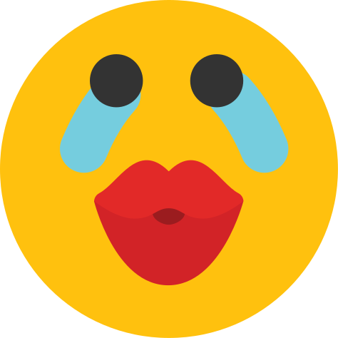
     
     
     
     
     
     
     
     
    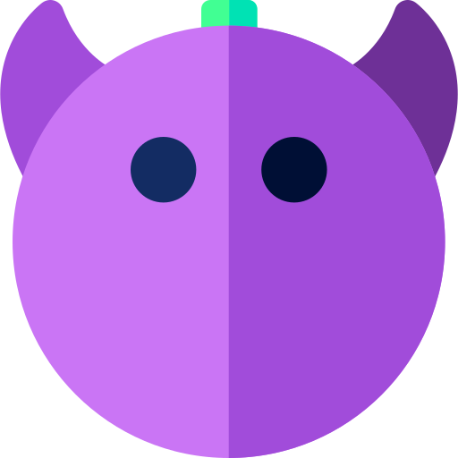
    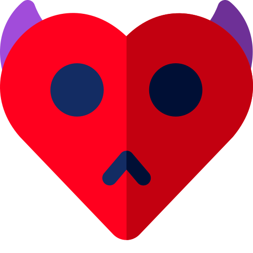
    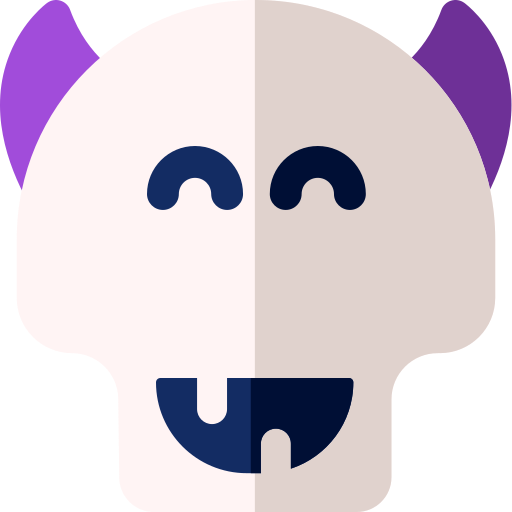
    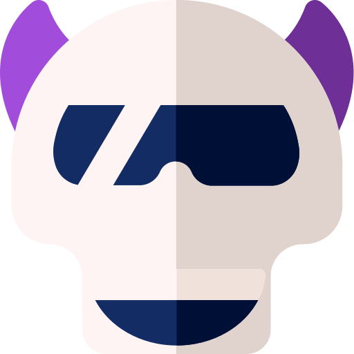
    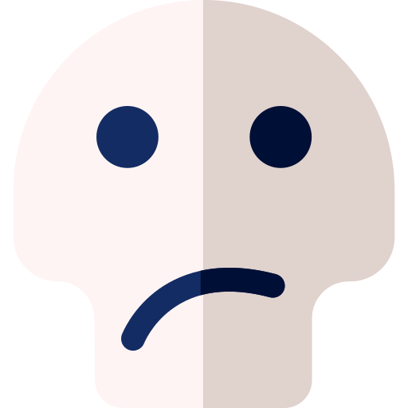
    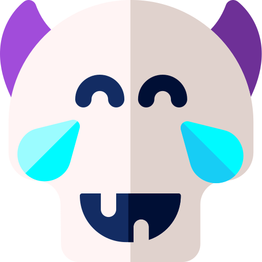

    
  

  

### SET 2

 
  

  

    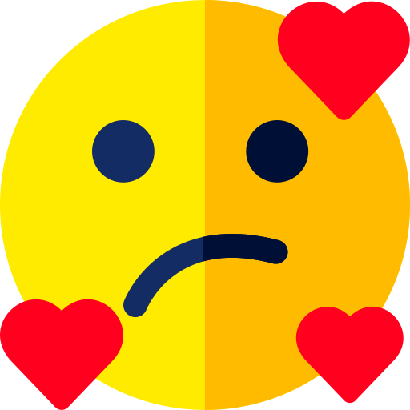
     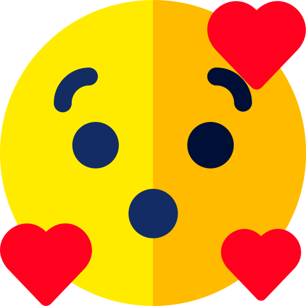
     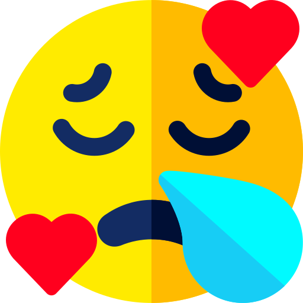
     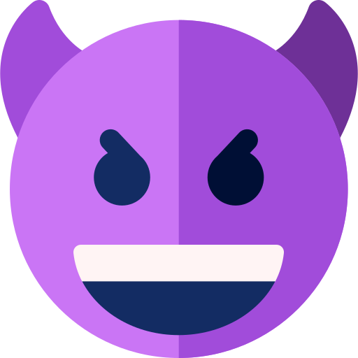
    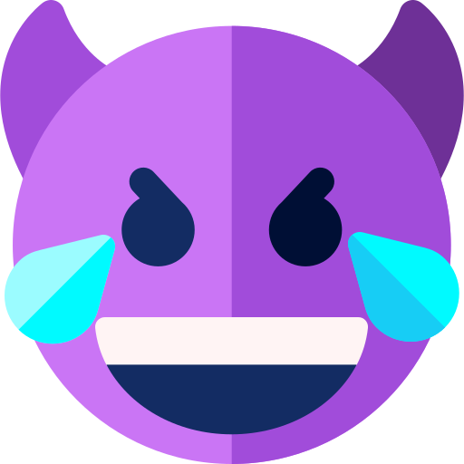
    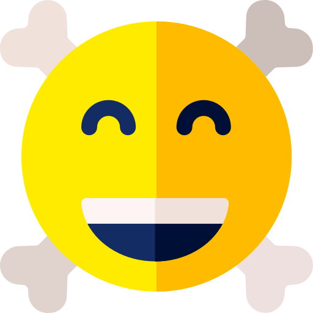
    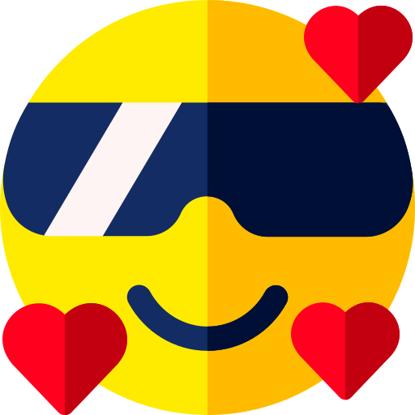
    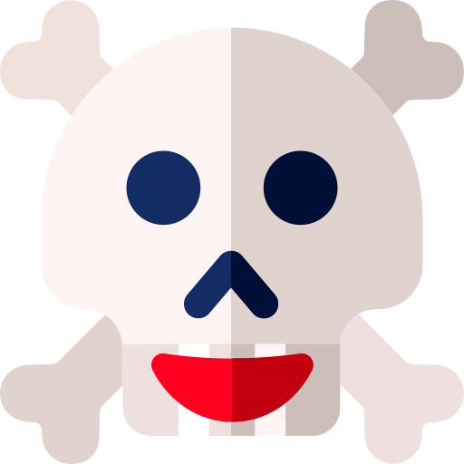
    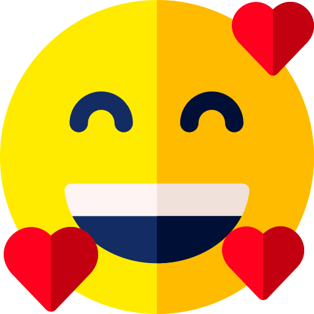
    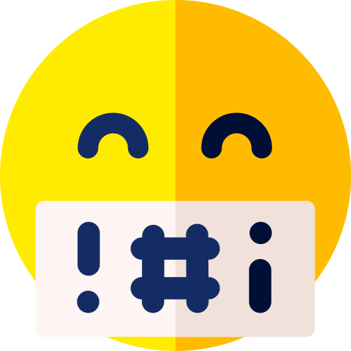
    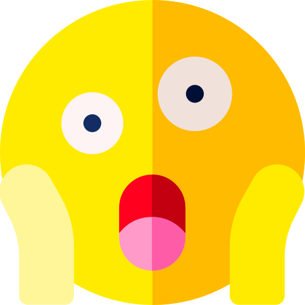
    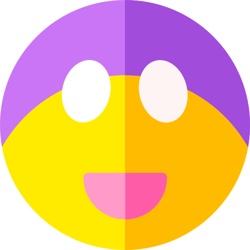
    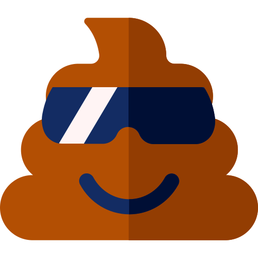
    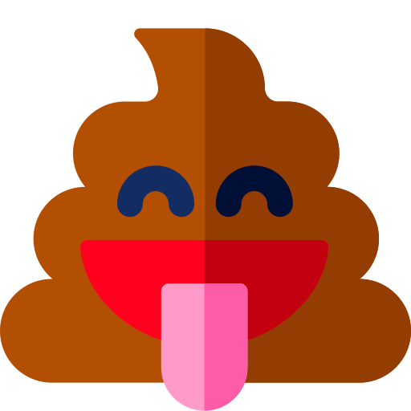
    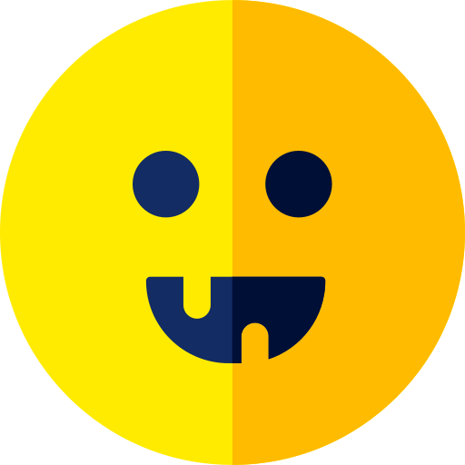
    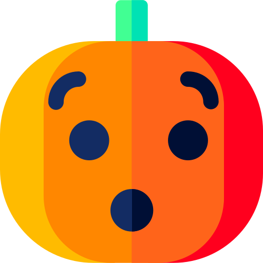
    
    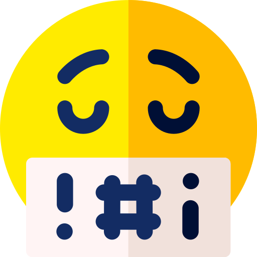
    
    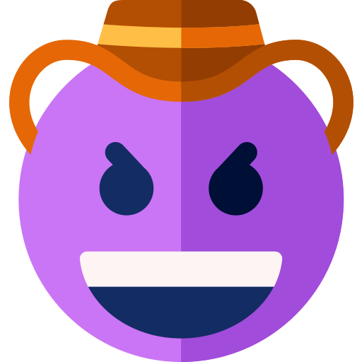
    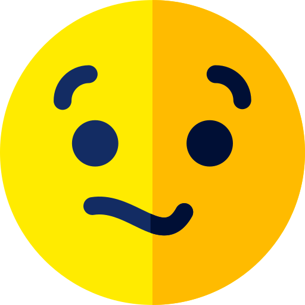
    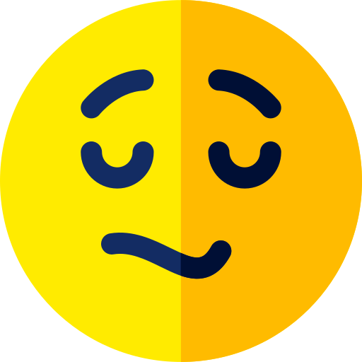
    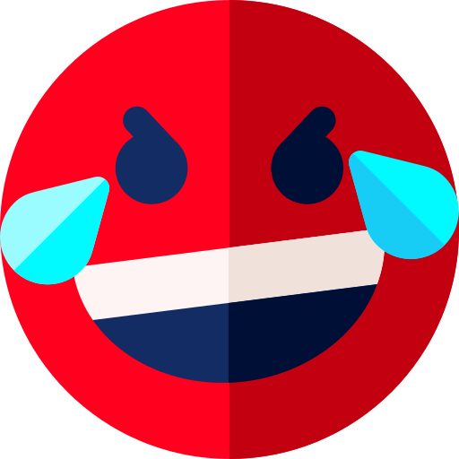
  

  

> original emojis by: https://www.flaticon.com/authors/freepik
